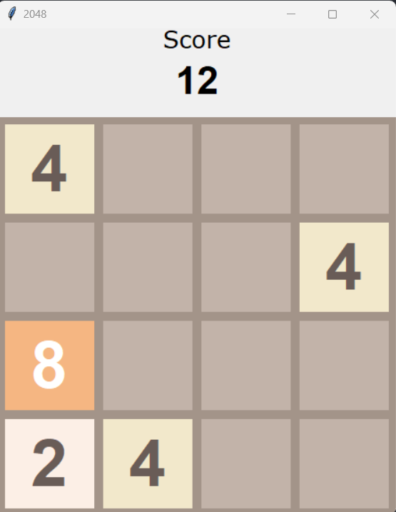

# About

2048 is a single-player sliding tile puzzle video game written by Italian web developer Gabriele Cirulli and published on GitHub. The game has simple and straightforward mechanics and dynamics, that are easy to understand and get around. The objective is to slide numbered tiles on a grid to combine them to create a tile with the number 2048.

## Libraries Used

* tkinter
* random
* sys

## Setup before run

- To start, run `2048.py` file or:
```bash
$ python 2048.py
```

# Screenshots
