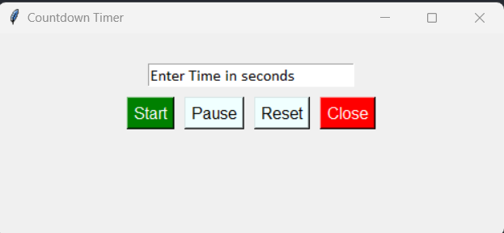

# Countdown Timer ⏱
Simple Stopwatch made with Python Tkinter

## Requirements
- Python version 3.10 or higher

## Setup before run

- To start, run `CountdownTimer.py` file or:
```bash
$ python CountdownTimer.py
```

# Screenshots

