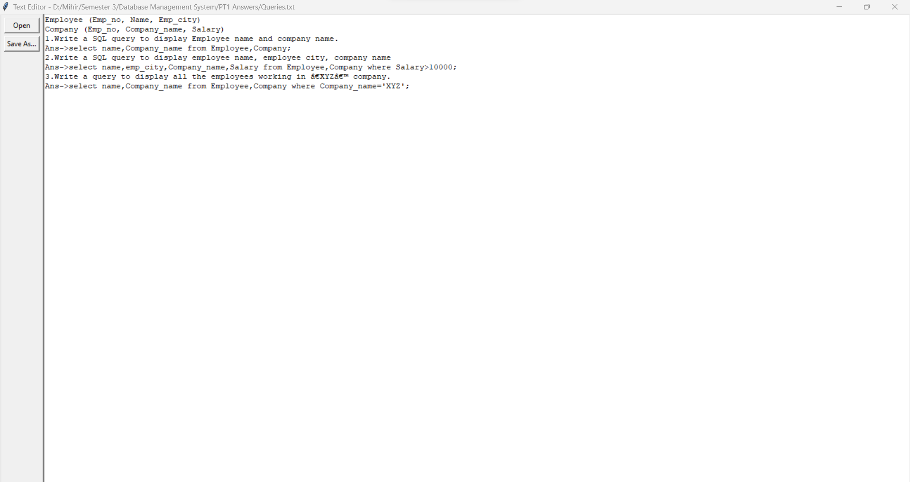

# Text Editor
Simple Text Editor made with Python Tkinter

## Requirements
- Python version 3.10 or higher

## Setup before run

- To start, run `TextEditor.py` file or:
```bash
$ python TextEditor.py.py
```

# Screenshots
