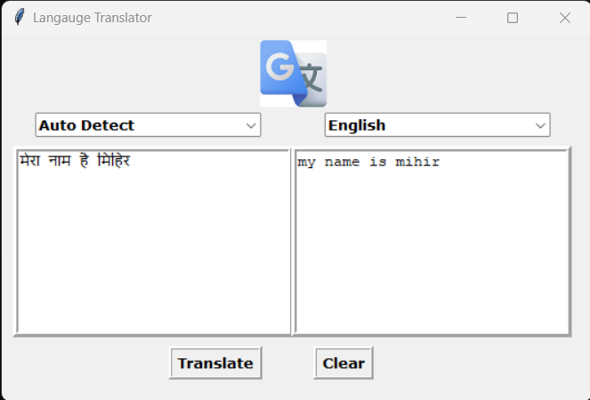

# About

Translation of sentences from one language to another python gui project


## Libraries Used

* tkinter
* googletrans
* Pillow

## Setup before run
- To install required modules run following command in terminal in project folder.
```bash
$ pip install -r requirements.txt
```
- To start, run `translator.py` file or:
```bash
$ python translator.py
```

# Screenshots
